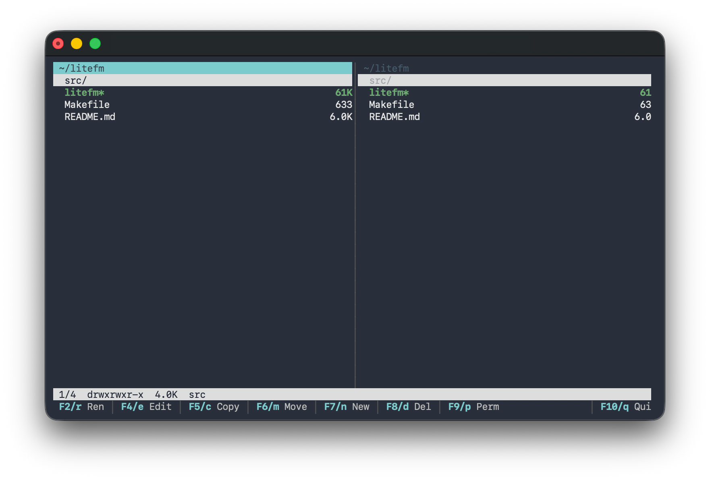

# litefm

A minimal two-pane file manager for the Linux terminal

- two independent panes side by side — copy / move from one into the other
- mouse support, marks, recursive search, chmod / chown
- one C file, only libc — no ncurses, no Rust, no Python (~45 KB binary)




## Build

Needs only a C compiler + libc:

```sh
cc -O2 -Wall -o litefm litefm.c
chmod +x litefm
./litefm
```

Tiny static build (e.g. for a container or rescue system):

```sh
cc -Os -s -Wall -static -o litefm litefm.c
```

### Install (optional)

```sh
sudo cp litefm /usr/local/bin/
```


## Usage

```sh
litefm                      # both panes start in the current directory
litefm ~/projekt ~/backup   # left pane, right pane
```


## Keys

| Key | Action |
|-----|--------|
| `Tab` | switch active pane |
| `j` `k` / `↓` `↑` · `g` `G` · `Ctrl-d` · `PgUp`/`PgDn` | move · top/bottom · half/full page |
| `l` | enter directory / open file in your editor — the only key that opens files |
| `Enter` `→` · `h` `←` `Backspace` | enter directory (no open) · go to parent |
| `Space` · `Shift`+`↑`/`↓` | toggle mark · mark while moving |
| `*` `+` `-` `u` | invert · mark / unmark by pattern · unmark all |
| `F5`/`c` · `F6`/`m` | copy · move selection: active pane → other pane |
| `F8`/`d`/`Del` · `F7`/`n` · `a` | delete · new dir · new file |
| `r`/`F2` · `F4`/`e` | rename · edit file (`$LITEFM_EDITOR`) |
| `p` · `o` | chmod (`rwx` grid overlay) · chown (`user[:group]`) |
| `s` · `/` · `.` | recursive search · filter · toggle hidden |
| `=` · `Ctrl-u` · `~` · `R` | sync other pane · swap panes · home · reload |
| `?` / `F1` · `q` | help · quit |
| mouse | click selects · click selected = open · right-click toggles mark · `Ctrl`+click = range · wheel scrolls |

Press **`F1`** inside the file manager for the full list.


## cd-on-quit

`litefm` writes the active pane's final directory to `$LITEFM_CWD_FILE` on quit, so a
tiny shell wrapper can `cd` there. Add this to your `~/.bashrc` or `~/.zshrc`:

```sh
litefm() {
    local tmp; tmp="$(mktemp)" || return
    LITEFM_CWD_FILE="$tmp" command litefm "$@"
    local d; d="$(cat "$tmp" 2>/dev/null)"; rm -f "$tmp"
    [ -n "$d" ] && [ -d "$d" ] && [ "$d" != "$PWD" ] && cd "$d"
}
```
